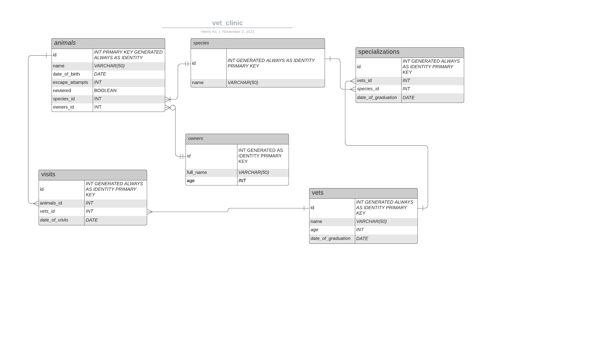

# Vet Clinic Database

> This is a project containing a vet clinic database. It is currently being worked on.
# Database Schema

# Lucidchart link to schema diagram
[Lucidchart Schema](https://lucid.app/lucidchart/1e0def65-66cc-46b3-b64f-3db10c299c06/edit?viewport_loc=75%2C88%2C1880%2C830%2C0_0&invitationId=inv_634610ad-ebc6-4ac0-8ce8-0c7000602864)
## Getting Started

This repository includes files with plain SQL that can be used to recreate a database:

- Use [schema.sql](./schema.sql) to create all tables.
- Use [data.sql](./data.sql) to populate tables with sample data.
- Check [queries.sql](./queries.sql) for examples of queries that can be run on a newly created database. **Important note: this file might include queries that make changes in the database (e.g., remove records). Use them responsibly!**

## Author

👤 **Henry Kc**

- GitHub: [@githubhandle](https://github.com/henrykc24)
- Twitter: [@twitterhandle](https://twitter.com/henrykc24)
- LinkedIn: [LinkedIn](https://linkedin.com/in/henry-kc)

## 🤝 Contributing

Contributions, issues, and feature requests are welcome!

Feel free to check the [issues page](https://github.com/HENRYKC24/vet-clinic-database/issues/).

## Show your support

Give a ⭐️ if you like this project!

## Acknowledgments

- Special thanks to Microverse for the template used in this project.
- Thanks to all my peers at Microverse that helped me during this project.

## 📝 License

This project is [MIT](./LICENSE) licensed.
